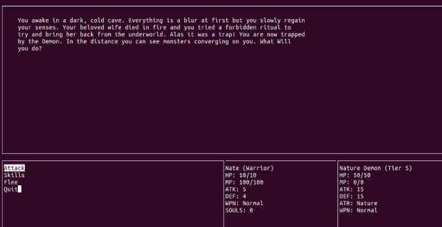

EE 205 is the second programming course available to electrical engineers, here we learn C++ to build upon the previous semester working in C. The official title of the class is "Object Oriented programming" and we are given a large degree of freedom when working on our final project, as long as we focus on utilizing the core programming concepts taught in the class. Being a group of gamers, we decided that it would be fun to work on a text based rpg, as it uses lots of elements that can be handled with classes and objects. We decided on a fantasy theme and appropriate name: "Soul Quest", after laying down our ideas for a basic combat system, player classes, items, and enemies, we set to work on programming.

Additionally, we learned valuable lessons about teamwork, delegation, and time management, as there were so many individual tasks that had to be managed to create this massive project. We needed effective communication within the team, as most of the modules depended on another module, and we had to make sure we understood how information would be passed between them. I worked on the spells, weapons, and damage system, while other important sub systems such as; UI, Combat, Monsters, and Random Generation were shared among other members of our team.

We were certainly not prepared for the level of complexity that this project entailed, there were so many different systems that needed to create and ensure seemless operation. We had a particularly difficult time getting the user interface to work, as it required us to learn how to use a completely new library called Ncurses. This allowed us to create a 4 option menu (attack, skills, flee, quit) similar to other traditional rpgs, and have the cursor highlight the selected option. We ended up with about 2000 lines of code, and a fully working game!

All related files to Soul Quest can be found here: https://github.com/aujared/EE205/tree/master/Final/project
