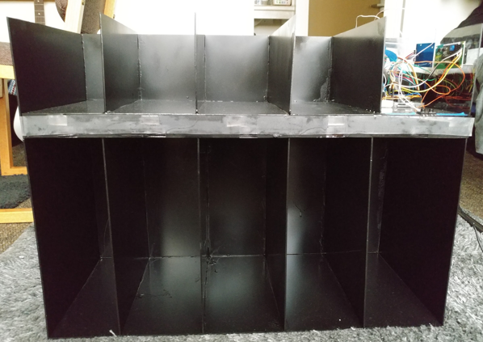

For my sophomore project class, my group and I decided to create a storage solution that integrated arduino hardware with a mobile app. Initial designs were a backpack insert, and over the door hanging packet, but we settled on the cubby/shelf design as it allowed us more stability and freedom with construction. The final design idea was a shelf built out of plexiglass, with compartments for books and other school related items. These items have a RFID sticker attached to them, which can be "checked in" and out of the shelf, which links the item to a specific slot. The phone app allows the user to set which slots they need on which days of the week, on the specified day, the cubby lights up those slots to indicate these items should be brought to class with you.

This was my first experience working with arduino hardware, and there was alot of learning to be done, from wiring/breadboarding, to coding in the arduino IDE, and lastly soldering. We needed so many digial outputs for all the LEDs that we exceeded the amount of physical ports on the arduino uno board. This required us to learn a new technique called charlie-plexing, a form of multiplexing that uses the one way current flow of diodes to artifically create more outputs. The cutting of the plexiglass was also a challenge as no hardware stores wanted to risk breaking the glass while cutting it for us, we had to make use of a scoring knife to slowly cut through the glass before ultimately breaking it.

This project was my first real forray into engineering projects, I learned many valuable lessons through all the problem solving and innovation that this project required.
